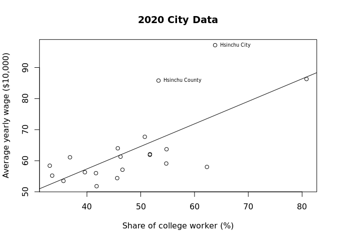

Workplace Wage by City
================

``` r
library(knitr)
library(readxl)
library(stargazer)
library(lmtest)
library(data.table)
```

# Import Data

``` r
rawGraduate <- read_excel("109cityu.xls")
rawWage <- read_excel("workplaceWageCity.xlsx")
rawWorkforce <- read_excel("cityWorkforce.xlsx")
```

``` r
CITY <- cbind(rawWage["...1"], rawWage["109"], rawWage["108"], rawWage["107"], rawGraduate$...10[5:24])
colnames(CITY) <- c("city", "wage2020", "wage2019", "wage2018", "graduate2020")
CITY$graduate2020 <- as.numeric(CITY$graduate2020)
direct <- seq(0, 0, length.out = 20)
direct[1:6] <- 1
CITY <- cbind(CITY, direct)
rm(direct)
```

## Workforce Data

# SLR with college graduates number

``` r
slr <- lm(CITY$wage2020 ~ CITY$graduate2020, )
summary(slr)
#stargazer(slr)
```

    ## 
    ## Call:
    ## lm(formula = CITY$wage2020 ~ CITY$graduate2020)
    ## 
    ## Residuals:
    ##     Min      1Q  Median      3Q     Max 
    ## -11.626  -5.494  -4.060   1.423  34.223 
    ## 
    ## Coefficients:
    ##                    Estimate Std. Error t value Pr(>|t|)    
    ## (Intercept)       6.003e+01  3.482e+00  17.241 1.23e-12 ***
    ## CITY$graduate2020 2.481e-04  1.615e-04   1.536    0.142    
    ## ---
    ## Signif. codes:  0 '***' 0.001 '**' 0.01 '*' 0.05 '.' 0.1 ' ' 1
    ## 
    ## Residual standard error: 11.73 on 18 degrees of freedom
    ## Multiple R-squared:  0.1159, Adjusted R-squared:  0.06674 
    ## F-statistic: 2.359 on 1 and 18 DF,  p-value: 0.142

``` r
plot(CITY$graduate2020, CITY$wage2020, main="2020 City Data", xlab="No. of Graduate", ylab="Average yearly wage ($10,000)")
text(CITY$graduate2020[c(8,19)], CITY$wage2020[c(8,19)], labels = c("Hsinchu County", "Hsinchu City"), cex = 0.6, pos = 4)
abline(slr)
```

<!-- -->

# SLR with college worker share

``` r
slr2 <- lm(CITY$wage2020 ~ CITY$workforceCollege_2020, )
summary(slr2)
#stargazer(slr2)
```

    ## 
    ## Call:
    ## lm(formula = CITY$wage2020 ~ CITY$workforceCollege_2020)
    ## 
    ## Residuals:
    ##      Min       1Q   Median       3Q      Max 
    ## -15.5443  -4.5628  -0.7453   2.5238  22.5534 
    ## 
    ## Coefficients:
    ##                            Estimate Std. Error t value Pr(>|t|)    
    ## (Intercept)                 28.3545     8.8623   3.199 0.004969 ** 
    ## CITY$workforceCollege_2020   0.7252     0.1779   4.077 0.000707 ***
    ## ---
    ## Signif. codes:  0 '***' 0.001 '**' 0.01 '*' 0.05 '.' 0.1 ' ' 1
    ## 
    ## Residual standard error: 8.991 on 18 degrees of freedom
    ## Multiple R-squared:  0.4801, Adjusted R-squared:  0.4512 
    ## F-statistic: 16.62 on 1 and 18 DF,  p-value: 0.0007073

``` r
plot(CITY$workforceCollege_2020, CITY$wage2020, main="2020 City Data", xlab="Share of college worker (%)", ylab="Average yearly wage ($10,000)")
text(CITY$workforceCollege_2020[c(8,19)], CITY$wage2020[c(8,19)], labels = c("Hsinchu County", "Hsinchu City"), cex = 0.6, pos = 4)
abline(slr2)
```

<!-- -->

# MLR

# Heteroskedaticity

## Test

We use the White Test for heteroskedaticity by specifying a formula with
interaction term and sqaure term to the BP Test.

``` r
bptest(slr2, ~ CITY$workforceCollege_2020 + I(CITY$workforceCollege_2020^2))
```

    ## 
    ##  studentized Breusch-Pagan test
    ## 
    ## data:  slr2
    ## BP = 4.351, df = 2, p-value = 0.1135

Heteroskedaticity doesn’t seem present.

## Robust
