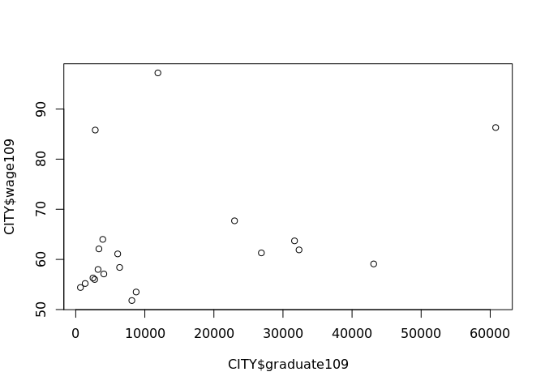

Workplace Wage by City
================

``` r
library(knitr)
library(readxl)
```

# Import Data

``` r
rawGraduate <- read_excel("109cityu.xls")
rawWage <- read_excel("workplaceWageCity.xlsx")
```

``` r
CITY <- cbind(rawWage["...1"], rawWage["109"], rawGraduate$...10[5:24])
colnames(CITY) <- c("city", "wage109", "graduate109")
CITY$graduate109 <- as.numeric(CITY$graduate109)
```

# SLR

``` r
slr <- lm(CITY$wage109 ~ CITY$graduate109, )
summary(slr)
```

    ## 
    ## Call:
    ## lm(formula = CITY$wage109 ~ CITY$graduate109)
    ## 
    ## Residuals:
    ##     Min      1Q  Median      3Q     Max 
    ## -11.626  -5.494  -4.060   1.423  34.223 
    ## 
    ## Coefficients:
    ##                   Estimate Std. Error t value Pr(>|t|)    
    ## (Intercept)      6.003e+01  3.482e+00  17.241 1.23e-12 ***
    ## CITY$graduate109 2.481e-04  1.615e-04   1.536    0.142    
    ## ---
    ## Signif. codes:  0 '***' 0.001 '**' 0.01 '*' 0.05 '.' 0.1 ' ' 1
    ## 
    ## Residual standard error: 11.73 on 18 degrees of freedom
    ## Multiple R-squared:  0.1159, Adjusted R-squared:  0.06674 
    ## F-statistic: 2.359 on 1 and 18 DF,  p-value: 0.142

``` r
plot(CITY$graduate109, CITY$wage109, main="2020 City Data", xlab="No. of Graduate", ylab="Average yearly wage ($10,000)")
text(CITY$graduate109[c(8,19)], CITY$wage109[c(8,19)], labels = c("Hsinchu County", "Hsinchu City"), cex = 0.6, pos = 4)
abline(slr)
```

<!-- -->
