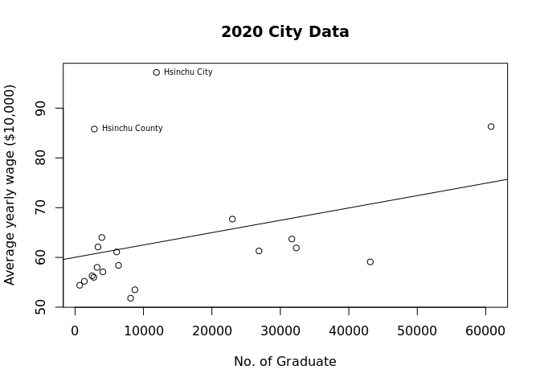
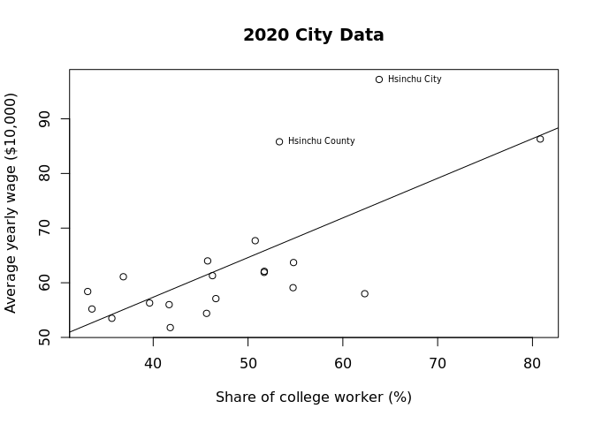

Workplace Wage by City
================

``` r
library(knitr)
library(readxl) #for reading Excel file
library(stargazer) #for Latex table generation
library(lmtest) #for heteroskedaticity test
library(data.table) #for transpose() function
library(ivreg)
```

# Import Data

``` r
rawGraduate <- read_excel("109cityu.xls")
rawWage <- read_excel("workplaceWageCity.xlsx")
rawWorkforce <- read_excel("cityWorkforce.xlsx")
```

``` r
CITY <- cbind(rawWage["...1"], rawWage["109"], rawWage["108"], rawWage["107"], rawGraduate$...10[5:24])
colnames(CITY) <- c("city", "wage2020", "wage2019", "wage2018", "graduate2020")
CITY$graduate2020 <- as.numeric(CITY$graduate2020)
direct <- seq(0, 0, length.out = 20)
direct[1:6] <- 1
CITY <- cbind(CITY, direct)
rm(direct)
```

## Data manipulation

``` r
CITY <- workforceTranspose("workforceCollege", 3, 14)
CITY <- workforceTranspose("workforceYoung", 16, 27)
CITY <- workforceTranspose("workforceMiddle", 29, 40)
CITY <- workforceTranspose("workforceOld", 42, 53)
CITY <- workforceTranspose("workforceRetired", 55, 66)
summary(CITY)
```

    ##      city              wage2020        wage2019        wage2018    
    ##  Length:20          Min.   :51.80   Min.   :51.60   Min.   :50.30  
    ##  Class :character   1st Qu.:56.23   1st Qu.:55.95   1st Qu.:54.90  
    ##  Mode  :character   Median :60.10   Median :59.70   Median :58.40  
    ##                     Mean   :63.55   Mean   :62.96   Mean   :61.79  
    ##                     3rd Qu.:63.77   3rd Qu.:63.45   3rd Qu.:61.77  
    ##                     Max.   :97.20   Max.   :94.80   Max.   :94.70  
    ##   graduate2020       direct    workforceCollege_2010 workforceCollege_2011
    ##  Min.   :  683   Min.   :0.0   Min.   :22.06         Min.   :23.28        
    ##  1st Qu.: 3128   1st Qu.:0.0   1st Qu.:31.89         1st Qu.:32.60        
    ##  Median : 6214   Median :0.0   Median :38.23         Median :38.52        
    ##  Mean   :14183   Mean   :0.3   Mean   :39.46         Mean   :40.33        
    ##  3rd Qu.:23959   3rd Qu.:1.0   3rd Qu.:43.44         3rd Qu.:44.59        
    ##  Max.   :60792   Max.   :1.0   Max.   :69.92         Max.   :71.40        
    ##  workforceCollege_2012 workforceCollege_2013 workforceCollege_2014
    ##  Min.   :24.44         Min.   :24.21         Min.   :25.49        
    ##  1st Qu.:32.89         1st Qu.:33.58         1st Qu.:35.09        
    ##  Median :39.80         Median :41.55         Median :42.13        
    ##  Mean   :41.02         Mean   :41.99         Mean   :43.20        
    ##  3rd Qu.:45.55         3rd Qu.:46.39         3rd Qu.:48.12        
    ##  Max.   :73.28         Max.   :76.05         Max.   :78.56        
    ##  workforceCollege_2015 workforceCollege_2016 workforceCollege_2017
    ##  Min.   :26.86         Min.   :28.11         Min.   :29.12        
    ##  1st Qu.:35.47         1st Qu.:36.74         1st Qu.:37.62        
    ##  Median :42.59         Median :44.20         Median :45.84        
    ##  Mean   :44.11         Mean   :45.16         Mean   :46.00        
    ##  3rd Qu.:49.08         3rd Qu.:49.54         3rd Qu.:50.52        
    ##  Max.   :80.23         Max.   :80.77         Max.   :81.05        
    ##  workforceCollege_2018 workforceCollege_2019 workforceCollege_2020
    ##  Min.   :30.64         Min.   :31.91         Min.   :33.09        
    ##  1st Qu.:39.17         1st Qu.:40.65         1st Qu.:41.16        
    ##  Median :46.01         Median :45.93         Median :46.43        
    ##  Mean   :46.83         Mean   :47.74         Mean   :48.52        
    ##  3rd Qu.:50.93         3rd Qu.:52.32         3rd Qu.:53.67        
    ##  Max.   :80.86         Max.   :79.11         Max.   :80.82        
    ##  workforceCollege_2021 workforceYoung_2010 workforceYoung_2011
    ##  Min.   :33.87         Min.   :5.160       Min.   :5.090      
    ##  1st Qu.:40.76         1st Qu.:6.750       1st Qu.:6.643      
    ##  Median :48.24         Median :7.430       Median :7.455      
    ##  Mean   :49.69         Mean   :7.291       Mean   :7.160      
    ##  3rd Qu.:54.35         3rd Qu.:8.145       3rd Qu.:7.737      
    ##  Max.   :83.58         Max.   :8.710       Max.   :8.280      
    ##  workforceYoung_2012 workforceYoung_2013 workforceYoung_2014
    ##  Min.   :5.190       Min.   :5.130       Min.   :4.970      
    ##  1st Qu.:6.468       1st Qu.:6.598       1st Qu.:6.652      
    ##  Median :7.280       Median :7.135       Median :7.090      
    ##  Mean   :7.167       Mean   :7.188       Mean   :7.152      
    ##  3rd Qu.:7.835       3rd Qu.:7.790       3rd Qu.:7.872      
    ##  Max.   :9.200       Max.   :9.300       Max.   :9.320      
    ##  workforceYoung_2015 workforceYoung_2016 workforceYoung_2017
    ##  Min.   :5.260       Min.   :5.540       Min.   :5.730      
    ##  1st Qu.:6.878       1st Qu.:7.095       1st Qu.:7.100      
    ##  Median :7.190       Median :7.410       Median :7.655      
    ##  Mean   :7.282       Mean   :7.484       Mean   :7.617      
    ##  3rd Qu.:7.565       3rd Qu.:7.952       3rd Qu.:8.127      
    ##  Max.   :9.460       Max.   :9.800       Max.   :9.700      
    ##  workforceYoung_2018 workforceYoung_2019 workforceYoung_2020
    ##  Min.   : 5.940      Min.   : 6.240      Min.   :6.120      
    ##  1st Qu.: 7.308      1st Qu.: 7.543      1st Qu.:7.160      
    ##  Median : 7.670      Median : 7.745      Median :7.575      
    ##  Mean   : 7.738      Mean   : 7.895      Mean   :7.651      
    ##  3rd Qu.: 8.140      3rd Qu.: 8.150      3rd Qu.:8.170      
    ##  Max.   :10.290      Max.   :10.020      Max.   :9.700      
    ##  workforceYoung_2021 workforceMiddle_2010 workforceMiddle_2011
    ##  Min.   :5.900       Min.   :50.92        Min.   :49.17       
    ##  1st Qu.:6.750       1st Qu.:54.26        1st Qu.:53.71       
    ##  Median :7.060       Median :55.98        Median :55.38       
    ##  Mean   :7.142       Mean   :56.15        Mean   :55.38       
    ##  3rd Qu.:7.570       3rd Qu.:58.21        3rd Qu.:57.32       
    ##  Max.   :8.660       Max.   :60.90        Max.   :60.52       
    ##  workforceMiddle_2012 workforceMiddle_2013 workforceMiddle_2014
    ##  Min.   :49.00        Min.   :48.21        Min.   :47.03       
    ##  1st Qu.:52.48        1st Qu.:51.62        1st Qu.:50.36       
    ##  Median :54.84        Median :54.47        Median :53.88       
    ##  Mean   :54.57        Mean   :53.92        Mean   :52.89       
    ##  3rd Qu.:56.73        3rd Qu.:55.70        3rd Qu.:54.79       
    ##  Max.   :59.31        Max.   :58.68        Max.   :58.12       
    ##  workforceMiddle_2015 workforceMiddle_2016 workforceMiddle_2017
    ##  Min.   :45.66        Min.   :45.37        Min.   :44.60       
    ##  1st Qu.:50.08        1st Qu.:49.36        1st Qu.:48.42       
    ##  Median :53.22        Median :52.70        Median :51.67       
    ##  Mean   :52.29        Mean   :51.94        Mean   :51.21       
    ##  3rd Qu.:54.40        3rd Qu.:54.35        3rd Qu.:53.33       
    ##  Max.   :57.53        Max.   :57.18        Max.   :56.98       
    ##  workforceMiddle_2018 workforceMiddle_2019 workforceMiddle_2020
    ##  Min.   :43.77        Min.   :43.84        Min.   :44.79       
    ##  1st Qu.:47.79        1st Qu.:48.05        1st Qu.:48.11       
    ##  Median :51.38        Median :50.65        Median :50.56       
    ##  Mean   :50.97        Mean   :50.69        Mean   :50.62       
    ##  3rd Qu.:53.55        3rd Qu.:53.05        3rd Qu.:53.12       
    ##  Max.   :57.29        Max.   :57.19        Max.   :56.48       
    ##  workforceMiddle_2021 workforceOld_2010 workforceOld_2011 workforceOld_2012
    ##  Min.   :45.30        Min.   :30.07     Min.   :30.41     Min.   :31.71    
    ##  1st Qu.:48.40        1st Qu.:32.75     1st Qu.:33.59     1st Qu.:34.48    
    ##  Median :50.97        Median :34.40     Median :35.48     Median :36.01    
    ##  Mean   :50.62        Mean   :34.18     Mean   :35.20     Mean   :35.94    
    ##  3rd Qu.:52.55        3rd Qu.:35.84     3rd Qu.:37.03     3rd Qu.:38.15    
    ##  Max.   :56.31        Max.   :38.85     Max.   :38.58     Max.   :38.77    
    ##  workforceOld_2013 workforceOld_2014 workforceOld_2015 workforceOld_2016
    ##  Min.   :32.30     Min.   :33.00     Min.   :34.00     Min.   :33.92    
    ##  1st Qu.:34.85     1st Qu.:35.61     1st Qu.:36.08     1st Qu.:36.29    
    ##  Median :36.47     Median :37.40     Median :37.73     Median :38.28    
    ##  Mean   :36.47     Mean   :37.28     Mean   :37.72     Mean   :37.94    
    ##  3rd Qu.:38.56     3rd Qu.:39.06     3rd Qu.:39.46     3rd Qu.:39.63    
    ##  Max.   :39.54     Max.   :40.57     Max.   :41.11     Max.   :41.32    
    ##  workforceOld_2017 workforceOld_2018 workforceOld_2019 workforceOld_2020
    ##  Min.   :34.43     Min.   :33.40     Min.   :33.91     Min.   :34.70    
    ##  1st Qu.:37.01     1st Qu.:36.60     1st Qu.:36.36     1st Qu.:36.64    
    ##  Median :38.51     Median :38.78     Median :39.00     Median :38.89    
    ##  Mean   :38.38     Mean   :38.41     Mean   :38.49     Mean   :38.58    
    ##  3rd Qu.:40.16     3rd Qu.:40.32     3rd Qu.:40.19     3rd Qu.:40.35    
    ##  Max.   :41.54     Max.   :41.88     Max.   :42.23     Max.   :41.15    
    ##  workforceOld_2021 workforceRetired_2010 workforceRetired_2011
    ##  Min.   :35.89     Min.   :0.630         Min.   :0.530        
    ##  1st Qu.:37.73     1st Qu.:1.407         1st Qu.:1.458        
    ##  Median :39.32     Median :2.035         Median :2.030        
    ##  Mean   :38.86     Mean   :2.373         Mean   :2.258        
    ##  3rd Qu.:40.19     3rd Qu.:3.058         3rd Qu.:3.025        
    ##  Max.   :42.00     Max.   :5.740         Max.   :5.650        
    ##  workforceRetired_2012 workforceRetired_2013 workforceRetired_2014
    ##  Min.   :0.710         Min.   :0.700         Min.   :0.900        
    ##  1st Qu.:1.528         1st Qu.:1.498         1st Qu.:1.768        
    ##  Median :2.100         Median :2.095         Median :2.150        
    ##  Mean   :2.321         Mean   :2.425         Mean   :2.673        
    ##  3rd Qu.:3.185         3rd Qu.:3.292         3rd Qu.:3.413        
    ##  Max.   :4.910         Max.   :5.700         Max.   :6.320        
    ##  workforceRetired_2015 workforceRetired_2016 workforceRetired_2017
    ##  Min.   :0.970         Min.   :0.870         Min.   :1.090        
    ##  1st Qu.:1.837         1st Qu.:1.495         1st Qu.:1.630        
    ##  Median :2.195         Median :2.340         Median :2.555        
    ##  Mean   :2.714         Mean   :2.638         Mean   :2.798        
    ##  3rd Qu.:3.305         3rd Qu.:3.255         3rd Qu.:3.538        
    ##  Max.   :6.890         Max.   :6.880         Max.   :6.590        
    ##  workforceRetired_2018 workforceRetired_2019 workforceRetired_2020
    ##  Min.   :0.920         Min.   :1.120         Min.   :1.080        
    ##  1st Qu.:1.708         1st Qu.:1.670         1st Qu.:1.923        
    ##  Median :2.460         Median :2.365         Median :2.670        
    ##  Mean   :2.877         Mean   :2.925         Mean   :3.155        
    ##  3rd Qu.:3.873         3rd Qu.:3.960         3rd Qu.:4.192        
    ##  Max.   :7.530         Max.   :7.320         Max.   :7.510        
    ##  workforceRetired_2021
    ##  Min.   :1.240        
    ##  1st Qu.:2.067        
    ##  Median :2.820        
    ##  Mean   :3.380        
    ##  3rd Qu.:4.487        
    ##  Max.   :7.590

# SLR with college graduates number

``` r
slr <- lm(CITY$wage2020 ~ CITY$graduate2020, )
summary(slr)
#stargazer(slr)
```

    ## 
    ## Call:
    ## lm(formula = CITY$wage2020 ~ CITY$graduate2020)
    ## 
    ## Residuals:
    ##     Min      1Q  Median      3Q     Max 
    ## -11.626  -5.494  -4.060   1.423  34.223 
    ## 
    ## Coefficients:
    ##                    Estimate Std. Error t value Pr(>|t|)    
    ## (Intercept)       6.003e+01  3.482e+00  17.241 1.23e-12 ***
    ## CITY$graduate2020 2.481e-04  1.615e-04   1.536    0.142    
    ## ---
    ## Signif. codes:  0 '***' 0.001 '**' 0.01 '*' 0.05 '.' 0.1 ' ' 1
    ## 
    ## Residual standard error: 11.73 on 18 degrees of freedom
    ## Multiple R-squared:  0.1159, Adjusted R-squared:  0.06674 
    ## F-statistic: 2.359 on 1 and 18 DF,  p-value: 0.142

``` r
plot(CITY$graduate2020, CITY$wage2020, main="2020 City Data", xlab="No. of Graduate", ylab="Average yearly wage ($10,000)")
text(CITY$graduate2020[c(8,19)], CITY$wage2020[c(8,19)], labels = c("Hsinchu County", "Hsinchu City"), cex = 0.6, pos = 4)
abline(slr)
```

<!-- -->

# SLR with college worker share

``` r
slr2 <- lm(CITY$wage2020 ~ CITY$workforceCollege_2020, )
summary(slr2)
#stargazer(slr2)
```

    ## 
    ## Call:
    ## lm(formula = CITY$wage2020 ~ CITY$workforceCollege_2020)
    ## 
    ## Residuals:
    ##      Min       1Q   Median       3Q      Max 
    ## -15.5443  -4.5628  -0.7453   2.5238  22.5534 
    ## 
    ## Coefficients:
    ##                            Estimate Std. Error t value Pr(>|t|)    
    ## (Intercept)                 28.3545     8.8623   3.199 0.004969 ** 
    ## CITY$workforceCollege_2020   0.7252     0.1779   4.077 0.000707 ***
    ## ---
    ## Signif. codes:  0 '***' 0.001 '**' 0.01 '*' 0.05 '.' 0.1 ' ' 1
    ## 
    ## Residual standard error: 8.991 on 18 degrees of freedom
    ## Multiple R-squared:  0.4801, Adjusted R-squared:  0.4512 
    ## F-statistic: 16.62 on 1 and 18 DF,  p-value: 0.0007073

``` r
plot(CITY$workforceCollege_2020, CITY$wage2020, main="2020 City Data", xlab="Share of college worker (%)", ylab="Average yearly wage ($10,000)")
text(CITY$workforceCollege_2020[c(8,19)], CITY$wage2020[c(8,19)], labels = c("Hsinchu County", "Hsinchu City"), cex = 0.6, pos = 4)
abline(slr2)
```

<!-- -->

## Heteroskedaticity

### Test

We use the White Test for heteroskedaticity by specifying a formula with
interaction term and sqaure term to the BP Test.

``` r
bptest(slr2, ~ CITY$workforceCollege_2020 + I(CITY$workforceCollege_2020^2))
```

    ## 
    ##  studentized Breusch-Pagan test
    ## 
    ## data:  slr2
    ## BP = 4.351, df = 2, p-value = 0.1135

Heteroskedaticity doesn’t seem present.

### Robust

# MLR

``` r
mlr <- lm(CITY$wage2020 ~ CITY$workforceCollege_2020 + CITY$direct + CITY$wage2018, )
summary(mlr)
#stargazer(mlr)
```

    ## 
    ## Call:
    ## lm(formula = CITY$wage2020 ~ CITY$workforceCollege_2020 + CITY$direct + 
    ##     CITY$wage2018)
    ## 
    ## Residuals:
    ##     Min      1Q  Median      3Q     Max 
    ## -1.2489 -0.3238  0.1111  0.3235  1.5463 
    ## 
    ## Coefficients:
    ##                            Estimate Std. Error t value Pr(>|t|)    
    ## (Intercept)                -2.31769    0.86964  -2.665   0.0169 *  
    ## CITY$workforceCollege_2020  0.05211    0.02062   2.528   0.0224 *  
    ## CITY$direct                -0.13042    0.38319  -0.340   0.7380    
    ## CITY$wage2018               1.02562    0.01879  54.582   <2e-16 ***
    ## ---
    ## Signif. codes:  0 '***' 0.001 '**' 0.01 '*' 0.05 '.' 0.1 ' ' 1
    ## 
    ## Residual standard error: 0.6781 on 16 degrees of freedom
    ## Multiple R-squared:  0.9974, Adjusted R-squared:  0.9969 
    ## F-statistic:  2024 on 3 and 16 DF,  p-value: < 2.2e-16

## Heteroskedaticity

### Test

We use the White Test for heteroskedaticity by specifying a formula with
interaction term and sqaure term to the BP Test.

``` r
bptest(mlr, ~ CITY$workforceCollege_2020 + CITY$workforceCollege_2020 + CITY$direct + CITY$wage2018 + I(CITY$workforceCollege_2020^2) + I(CITY$wage2018^2) + I(CITY$workforceCollege_2020*CITY$wage2018))
```

    ## 
    ##  studentized Breusch-Pagan test
    ## 
    ## data:  mlr
    ## BP = 9.7492, df = 6, p-value = 0.1356

Heteroskedaticity doesn’t seem present.

### Robust

## Instrumental variable: workforce age structure

``` r
IVmlr <- ivreg(CITY$wage2020 ~ CITY$workforceCollege_2020 + CITY$direct + CITY$wage2018 | CITY$workforceMiddle_2010 + CITY$workforceOld_2010)
```

    ## Warning in ivreg.fit(X, Y, Z, weights, offset, method, ...): more regressors
    ## than instruments

``` r
summary(IVmlr)
```

    ## 
    ## Call:
    ## ivreg(formula = CITY$wage2020 ~ CITY$workforceCollege_2020 + 
    ##     CITY$direct + CITY$wage2018 | CITY$workforceMiddle_2010 + 
    ##     CITY$workforceOld_2010)
    ## 
    ## Residuals:
    ##     Min      1Q  Median      3Q     Max 
    ## -338.29 -134.86  -35.30   94.21  398.76 
    ## 
    ## Coefficients:
    ##                            Estimate Std. Error t value Pr(>|t|)
    ## (Intercept)                 -386.09    6269.77  -0.062    0.952
    ## CITY$workforceCollege_2020    12.56     177.78   0.071    0.945
    ## CITY$direct                 -532.10    7861.76  -0.068    0.947
    ## CITY$wage2018                    NA         NA      NA       NA
    ## 
    ## Diagnostic tests:
    ##                                               df1 df2 statistic  p-value    
    ## Weak instruments (CITY$workforceCollege_2020)   2  17    10.877 0.000908 ***
    ## Weak instruments (CITY$direct)                  2  17     1.798 0.195695    
    ## Weak instruments (CITY$wage2018)                2  17     2.583 0.104817    
    ## Wu-Hausman                                      2  14     0.771 0.481229    
    ## Sargan                                         -1  NA        NA       NA    
    ## ---
    ## Signif. codes:  0 '***' 0.001 '**' 0.01 '*' 0.05 '.' 0.1 ' ' 1
    ## 
    ## Residual standard error: 233.6 on 17 degrees of freedom
    ## Multiple R-Squared: -330.4,  Adjusted R-squared: -369.3 
    ## Wald test: 0.006003 on 2 and 17 DF,  p-value: 0.994
