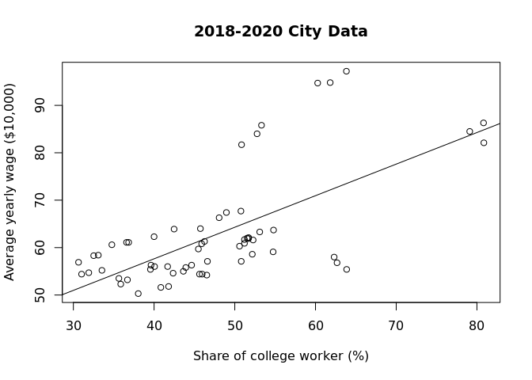

Workplace Wage by City
================

``` r
library(knitr)
library(readxl) #for reading Excel file
library(stargazer) #for Latex table generation
library(lmtest) #for heteroskedaticity test
library(data.table) #for transpose() function
library(ivreg) #for instrumental variable 2SLS regression
library(dplyr) #for mutate
library(robustbase) #for HAC std error
library(plm) #for panel data
library(stringr)
```

# Import Data

``` r
rawGraduate <- read_excel("109cityu.xls")
rawWage <- read_excel("workplaceWageCity.xlsx")
rawWorkforce <- read_excel("cityWorkforce.xlsx")
rawCityAddition <- read_excel("additionalCityData.xlsx")
```

``` r
CITY <- cbind(rawWage["...1"], rawWage["109"], rawWage["108"], rawWage["107"], rawGraduate$...10[5:24])
colnames(CITY) <- c("city", "wage2020", "wage2019", "wage2018", "graduate2020")
CITY$graduate2020 <- as.numeric(CITY$graduate2020)
direct <- seq(0, 0, length.out = 20)
direct[1:6] <- 1
CITY <- cbind(CITY, direct)
rm(direct)
```

## Data manipulation

``` r
CITY <- workforceTranspose("workforceCollege", 3, 14)
CITY <- workforceTranspose("workforceYoung", 16, 27)
CITY <- workforceTranspose("workforceMiddle", 29, 40)
CITY <- workforceTranspose("workforceOld", 42, 53)
CITY <- workforceTranspose("workforceRetired", 55, 66)
```

``` r
for(i in 2:ncol(rawCityAddition)) {
    if(!is.na(rawCityAddition[2, i])){
        CITY <- cbind(CITY, as.numeric(unlist(rawCityAddition[1:20, i])))
    }   
}
```

``` r
colnames(CITY)[67:69] <- c("hired2018", "hired2019", "hired2020")
colnames(CITY)[71:73] <- c("workforcePopulation2018", "workforcePopulation2019", "workforcePopulation2020")
colnames(CITY)[75:77] <- c("gender2018", "gender2019", "gender2020")
colnames(CITY)[79:81] <- c("manufecture2018", "manufecture2019", "manufecture2020")
colnames(CITY)[83:85] <- c("service2018", "service2019", "service2020")
colnames(CITY)[87:89] <- c("eduExpense2018", "eduExpense2019", "eduExpense2020")
colnames(CITY)[91:93] <- c("married2018", "married2019", "married2020")
colnames(CITY)[95:97] <- c("eduLevel2018", "eduLevel2019", "eduLevel2020")
colnames(CITY)[99:101] <- c("expensePerCapita2018", "expensePerCapita2019", "expensePerCapita2020")
colnames(CITY)[103:105] <- c("unemployment2018", "unemployment2019", "unemployment2020")
```

``` r
nacol <- vector()
for(j in 1:ncol(CITY)) {
    if(is.na(CITY[2, j])) {
        nacol <- c(nacol, j)
    }
}
CITY <- CITY[-nacol]
```

``` r
CITY <- mutate(CITY, lwage2020 = log(wage2020), lwage2019 = log(wage2019), lwage2018 = log(wage2018), 
directEdu2020 = direct * workforceCollege_2020, directEdu2019 = direct * workforceCollege_2019, directEdu2018 = direct * workforceCollege_2018, 
graduateShare2020 = graduate2020/workforcePopulation2020)
```

# SLR with college graduates number

``` r
slr <- lm(CITY$wage2020 ~ CITY$graduate2020, )
summary(slr)
#stargazer(slr)
slr1 <- lm(CITY$wage2020 ~ CITY$graduateShare2020)
```

    ## 
    ## Call:
    ## lm(formula = CITY$wage2020 ~ CITY$graduate2020)
    ## 
    ## Residuals:
    ##     Min      1Q  Median      3Q     Max 
    ## -11.626  -5.494  -4.060   1.423  34.223 
    ## 
    ## Coefficients:
    ##                    Estimate Std. Error t value Pr(>|t|)    
    ## (Intercept)       6.003e+01  3.482e+00  17.241 1.23e-12 ***
    ## CITY$graduate2020 2.481e-04  1.615e-04   1.536    0.142    
    ## ---
    ## Signif. codes:  0 '***' 0.001 '**' 0.01 '*' 0.05 '.' 0.1 ' ' 1
    ## 
    ## Residual standard error: 11.73 on 18 degrees of freedom
    ## Multiple R-squared:  0.1159, Adjusted R-squared:  0.06674 
    ## F-statistic: 2.359 on 1 and 18 DF,  p-value: 0.142

``` r
plot(CITY$graduate2020, CITY$wage2020, main="2020 City Data", xlab="No. of Graduate", ylab="Average yearly wage ($10,000)")
text(CITY$graduate2020[c(8,19)], CITY$wage2020[c(8,19)], labels = c("Hsinchu County", "Hsinchu City"), cex = 0.6, pos = 4)
abline(slr)
```

<!-- -->

# SLR with college worker share

``` r
slr2 <- lm(CITY$wage2020 ~ CITY$workforceCollege_2020, )
summary(slr2)
#stargazer(slr2)
```

    ## 
    ## Call:
    ## lm(formula = CITY$wage2020 ~ CITY$workforceCollege_2020)
    ## 
    ## Residuals:
    ##      Min       1Q   Median       3Q      Max 
    ## -15.5443  -4.5628  -0.7453   2.5238  22.5534 
    ## 
    ## Coefficients:
    ##                            Estimate Std. Error t value Pr(>|t|)    
    ## (Intercept)                 28.3545     8.8623   3.199 0.004969 ** 
    ## CITY$workforceCollege_2020   0.7252     0.1779   4.077 0.000707 ***
    ## ---
    ## Signif. codes:  0 '***' 0.001 '**' 0.01 '*' 0.05 '.' 0.1 ' ' 1
    ## 
    ## Residual standard error: 8.991 on 18 degrees of freedom
    ## Multiple R-squared:  0.4801, Adjusted R-squared:  0.4512 
    ## F-statistic: 16.62 on 1 and 18 DF,  p-value: 0.0007073

``` r
plot(CITY$workforceCollege_2020, CITY$wage2020, main="2020 City Data", xlab="Share of college worker (%)", ylab="Average yearly wage ($10,000)")
text(CITY$workforceCollege_2020[c(8,19)], CITY$wage2020[c(8,19)], labels = c("Hsinchu County", "Hsinchu City"), cex = 0.6, pos = 4)
abline(slr2)
```

<!-- -->

## Heteroskedaticity

### Test

``` r
bptest(slr2, ~ CITY$workforceCollege_2020 + I(CITY$workforceCollege_2020^2))
```

    ## 
    ##  studentized Breusch-Pagan test
    ## 
    ## data:  slr2
    ## BP = 4.351, df = 2, p-value = 0.1135

Heteroskedaticity doesn’t seem present.

### Robust

# MLR

``` r
mlr2 <- lm(wage2020 ~ workforceCollege_2020 + direct + hired2020 + manufecture2020 + service2020 + gender2020 + eduExpense2020 + eduLevel2020 + married2020 + expensePerCapita2020 + unemployment2020 + directEdu2020 ,data = CITY)
summary(mlr2)
bptest(mlr2)
```

    ## 
    ## Call:
    ## lm(formula = wage2020 ~ workforceCollege_2020 + direct + hired2020 + 
    ##     manufecture2020 + service2020 + gender2020 + eduExpense2020 + 
    ##     eduLevel2020 + married2020 + expensePerCapita2020 + unemployment2020 + 
    ##     directEdu2020, data = CITY)
    ## 
    ## Residuals:
    ##     Min      1Q  Median      3Q     Max 
    ## -6.1361 -1.6886  0.2735  1.4482  4.1449 
    ## 
    ## Coefficients:
    ##                         Estimate Std. Error t value Pr(>|t|)   
    ## (Intercept)           -2.686e+02  1.713e+02  -1.568  0.16079   
    ## workforceCollege_2020 -8.180e-01  1.814e+00  -0.451  0.66571   
    ## direct                 8.130e+01  2.344e+01   3.468  0.01043 * 
    ## hired2020              1.486e+00  6.083e-01   2.442  0.04463 * 
    ## manufecture2020       -2.045e+00  8.503e-01  -2.405  0.04712 * 
    ## service2020           -1.049e+00  9.145e-01  -1.147  0.28896   
    ## gender2020             2.499e+00  9.936e-01   2.515  0.04010 * 
    ## eduExpense2020         1.162e+00  5.716e-01   2.034  0.08148 . 
    ## eduLevel2020           1.866e+00  1.746e+00   1.069  0.32058   
    ## married2020            1.504e+00  1.141e+00   1.318  0.22909   
    ## expensePerCapita2020   2.899e-03  6.514e-04   4.450  0.00297 **
    ## unemployment2020      -3.147e+01  2.121e+01  -1.483  0.18155   
    ## directEdu2020         -1.531e+00  4.155e-01  -3.686  0.00780 **
    ## ---
    ## Signif. codes:  0 '***' 0.001 '**' 0.01 '*' 0.05 '.' 0.1 ' ' 1
    ## 
    ## Residual standard error: 4.055 on 7 degrees of freedom
    ## Multiple R-squared:  0.9589, Adjusted R-squared:  0.8884 
    ## F-statistic:  13.6 on 12 and 7 DF,  p-value: 0.001024
    ## 
    ## 
    ##  studentized Breusch-Pagan test
    ## 
    ## data:  mlr2
    ## BP = 10.651, df = 12, p-value = 0.559

## F-test for educational variable

``` r
edu <- lm(wage2020 ~ workforceCollege_2020 + eduExpense2020 + eduLevel2020, data = CITY)
summary(edu)
```

    ## 
    ## Call:
    ## lm(formula = wage2020 ~ workforceCollege_2020 + eduExpense2020 + 
    ##     eduLevel2020, data = CITY)
    ## 
    ## Residuals:
    ##     Min      1Q  Median      3Q     Max 
    ## -11.647  -4.011  -1.883   2.755  19.845 
    ## 
    ## Coefficients:
    ##                       Estimate Std. Error t value Pr(>|t|)
    ## (Intercept)             9.4242    18.9259   0.498    0.625
    ## workforceCollege_2020   0.9457     1.2312   0.768    0.454
    ## eduExpense2020          0.6498     0.5304   1.225    0.238
    ## eduLevel2020           -0.3332     1.2592  -0.265    0.795
    ## 
    ## Residual standard error: 9.118 on 16 degrees of freedom
    ## Multiple R-squared:  0.5247, Adjusted R-squared:  0.4356 
    ## F-statistic: 5.889 on 3 and 16 DF,  p-value: 0.006598

## Use college worker share as main explanatory

``` r
mlr <- lm(CITY$wage2020 ~ CITY$workforceCollege_2020 + CITY$direct + CITY$wage2018 + CITY$manufecture2020 + CITY$hired2020, )
summary(mlr)
#stargazer(mlr)
```

    ## 
    ## Call:
    ## lm(formula = CITY$wage2020 ~ CITY$workforceCollege_2020 + CITY$direct + 
    ##     CITY$wage2018 + CITY$manufecture2020 + CITY$hired2020)
    ## 
    ## Residuals:
    ##      Min       1Q   Median       3Q      Max 
    ## -0.99226 -0.36933 -0.01989  0.35062  1.45209 
    ## 
    ## Coefficients:
    ##                            Estimate Std. Error t value Pr(>|t|)    
    ## (Intercept)                -1.25935    2.00540  -0.628   0.5401    
    ## CITY$workforceCollege_2020  0.07512    0.02882   2.606   0.0207 *  
    ## CITY$direct                -0.19412    0.41273  -0.470   0.6454    
    ## CITY$wage2018               1.01685    0.02115  48.086   <2e-16 ***
    ## CITY$manufecture2020        0.02534    0.02161   1.173   0.2605    
    ## CITY$hired2020             -0.03220    0.03756  -0.857   0.4057    
    ## ---
    ## Signif. codes:  0 '***' 0.001 '**' 0.01 '*' 0.05 '.' 0.1 ' ' 1
    ## 
    ## Residual standard error: 0.6892 on 14 degrees of freedom
    ## Multiple R-squared:  0.9976, Adjusted R-squared:  0.9968 
    ## F-statistic:  1176 on 5 and 14 DF,  p-value: < 2.2e-16

### Heteroskedaticity

#### Test

``` r
bptest(mlr)
```

    ## 
    ##  studentized Breusch-Pagan test
    ## 
    ## data:  mlr
    ## BP = 10.854, df = 5, p-value = 0.05435

#### Robust

``` r
mlrrob <- lmrob(CITY$wage2020 ~ CITY$workforceCollege_2020 + CITY$direct + CITY$wage2018 + CITY$manufecture2020 + CITY$hired2020, )
summary(mlrrob)
#stargazer(mlrrob)
```

    ## 
    ## Call:
    ## lmrob(formula = CITY$wage2020 ~ CITY$workforceCollege_2020 + CITY$direct + 
    ##     CITY$wage2018 + CITY$manufecture2020 + CITY$hired2020)
    ##  \--> method = "MM"
    ## Residuals:
    ##      Min       1Q   Median       3Q      Max 
    ## -1.11185 -0.22967  0.01904  0.32530  2.21284 
    ## 
    ## Coefficients:
    ##                             Estimate Std. Error t value Pr(>|t|)    
    ## (Intercept)                 0.290339   1.612505   0.180    0.860    
    ## CITY$workforceCollege_2020  0.079674   0.013457   5.920 3.73e-05 ***
    ## CITY$direct                 0.020426   0.239663   0.085    0.933    
    ## CITY$wage2018               0.997127   0.010547  94.539  < 2e-16 ***
    ## CITY$manufecture2020        0.009307   0.022067   0.422    0.680    
    ## CITY$hired2020             -0.034386   0.042429  -0.810    0.431    
    ## ---
    ## Signif. codes:  0 '***' 0.001 '**' 0.01 '*' 0.05 '.' 0.1 ' ' 1
    ## 
    ## Robust residual standard error: 0.4739 
    ## Multiple R-squared:  0.9985, Adjusted R-squared:  0.998 
    ## Convergence in 16 IRWLS iterations
    ## 
    ## Robustness weights: 
    ##  observation 8 is an outlier with |weight| <= 4.3e-05 ( < 0.005); 
    ##  2 weights are ~= 1. The remaining 17 ones are summarized as
    ##    Min. 1st Qu.  Median    Mean 3rd Qu.    Max. 
    ##  0.5613  0.9289  0.9621  0.9215  0.9790  0.9951 
    ## Algorithmic parameters: 
    ##        tuning.chi                bb        tuning.psi        refine.tol 
    ##         1.548e+00         5.000e-01         4.685e+00         1.000e-07 
    ##           rel.tol         scale.tol         solve.tol       eps.outlier 
    ##         1.000e-07         1.000e-10         1.000e-07         5.000e-03 
    ##             eps.x warn.limit.reject warn.limit.meanrw 
    ##         1.723e-10         5.000e-01         5.000e-01 
    ##      nResample         max.it       best.r.s       k.fast.s          k.max 
    ##            500             50              2              1            200 
    ##    maxit.scale      trace.lev            mts     compute.rd fast.s.large.n 
    ##            200              0           1000              0           2000 
    ##                   psi           subsampling                   cov 
    ##            "bisquare"         "nonsingular"         ".vcov.avar1" 
    ## compute.outlier.stats 
    ##                  "SM" 
    ## seed : int(0)

## Use educational level as main explanatory

``` r
edulevel <- lm(wage2020 ~ direct + manufecture2020 + eduLevel2020 + hired2020 + wage2018, data = CITY)
summary(edulevel)
bptest(edulevel)
edulevelrob <- lmrob(wage2020 ~ direct + manufecture2020 + eduLevel2020 + hired2020 + wage2018, data = CITY)
summary(edulevelrob)
```

    ## 
    ## Call:
    ## lm(formula = wage2020 ~ direct + manufecture2020 + eduLevel2020 + 
    ##     hired2020 + wage2018, data = CITY)
    ## 
    ## Residuals:
    ##      Min       1Q   Median       3Q      Max 
    ## -1.00812 -0.34616 -0.02858  0.28334  1.55342 
    ## 
    ## Coefficients:
    ##                 Estimate Std. Error t value Pr(>|t|)    
    ## (Intercept)     -1.96671    1.87630  -1.048   0.3123    
    ## direct          -0.32164    0.42148  -0.763   0.4581    
    ## manufecture2020  0.02228    0.02038   1.093   0.2927    
    ## eduLevel2020     0.07080    0.02573   2.752   0.0156 *  
    ## hired2020       -0.01174    0.03253  -0.361   0.7235    
    ## wage2018         1.01497    0.02091  48.551   <2e-16 ***
    ## ---
    ## Signif. codes:  0 '***' 0.001 '**' 0.01 '*' 0.05 '.' 0.1 ' ' 1
    ## 
    ## Residual standard error: 0.6766 on 14 degrees of freedom
    ## Multiple R-squared:  0.9977, Adjusted R-squared:  0.9969 
    ## F-statistic:  1220 on 5 and 14 DF,  p-value: < 2.2e-16
    ## 
    ## 
    ##  studentized Breusch-Pagan test
    ## 
    ## data:  edulevel
    ## BP = 11.97, df = 5, p-value = 0.0352
    ## 
    ## 
    ## Call:
    ## lmrob(formula = wage2020 ~ direct + manufecture2020 + eduLevel2020 + hired2020 + 
    ##     wage2018, data = CITY)
    ##  \--> method = "MM"
    ## Residuals:
    ##      Min       1Q   Median       3Q      Max 
    ## -0.84669 -0.26122  0.05761  0.30488  2.38793 
    ## 
    ## Coefficients:
    ##                  Estimate Std. Error t value Pr(>|t|)    
    ## (Intercept)     -0.247533   1.673364  -0.148 0.884511    
    ## direct          -0.106571   0.212691  -0.501 0.624115    
    ## manufecture2020  0.008061   0.020700   0.389 0.702828    
    ## eduLevel2020     0.079934   0.015476   5.165 0.000143 ***
    ## hired2020       -0.017022   0.040925  -0.416 0.683768    
    ## wage2018         0.992269   0.009169 108.223  < 2e-16 ***
    ## ---
    ## Signif. codes:  0 '***' 0.001 '**' 0.01 '*' 0.05 '.' 0.1 ' ' 1
    ## 
    ## Robust residual standard error: 0.3719 
    ## Multiple R-squared:  0.9988, Adjusted R-squared:  0.9984 
    ## Convergence in 19 IRWLS iterations
    ## 
    ## Robustness weights: 
    ##  observation 8 is an outlier with |weight| = 0 ( < 0.005); 
    ##  The remaining 19 ones are summarized as
    ##    Min. 1st Qu.  Median    Mean 3rd Qu.    Max. 
    ##  0.5835  0.9200  0.9542  0.9114  0.9736  0.9979 
    ## Algorithmic parameters: 
    ##        tuning.chi                bb        tuning.psi        refine.tol 
    ##         1.548e+00         5.000e-01         4.685e+00         1.000e-07 
    ##           rel.tol         scale.tol         solve.tol       eps.outlier 
    ##         1.000e-07         1.000e-10         1.000e-07         5.000e-03 
    ##             eps.x warn.limit.reject warn.limit.meanrw 
    ##         1.723e-10         5.000e-01         5.000e-01 
    ##      nResample         max.it       best.r.s       k.fast.s          k.max 
    ##            500             50              2              1            200 
    ##    maxit.scale      trace.lev            mts     compute.rd fast.s.large.n 
    ##            200              0           1000              0           2000 
    ##                   psi           subsampling                   cov 
    ##            "bisquare"         "nonsingular"         ".vcov.avar1" 
    ## compute.outlier.stats 
    ##                  "SM" 
    ## seed : int(0)

## Instrumental variable: workforce age structure

### First stage results

``` r
fs <- lm(CITY$workforceCollege_2020 ~ CITY$workforceYoung_2010)
summary(fs)
```

    ## 
    ## Call:
    ## lm(formula = CITY$workforceCollege_2020 ~ CITY$workforceYoung_2010)
    ## 
    ## Residuals:
    ##      Min       1Q   Median       3Q      Max 
    ## -15.7525  -7.3072   0.0906   7.3772  19.8412 
    ## 
    ## Coefficients:
    ##                          Estimate Std. Error t value Pr(>|t|)    
    ## (Intercept)                91.140     19.525   4.668 0.000192 ***
    ## CITY$workforceYoung_2010   -5.845      2.658  -2.199 0.041200 *  
    ## ---
    ## Signif. codes:  0 '***' 0.001 '**' 0.01 '*' 0.05 '.' 0.1 ' ' 1
    ## 
    ## Residual standard error: 10.58 on 18 degrees of freedom
    ## Multiple R-squared:  0.2117, Adjusted R-squared:  0.1679 
    ## F-statistic: 4.835 on 1 and 18 DF,  p-value: 0.0412

### 2SLS

``` r
IVmlr <- ivreg(CITY$wage2020 ~ CITY$direct + CITY$wage2018 + CITY$manufecture2020 + CITY$hired2020 | CITY$workforceCollege_2020 | CITY$workforceYoung_2010)
summary(IVmlr)
```

    ## 
    ## Call:
    ## ivreg(formula = CITY$wage2020 ~ CITY$direct + CITY$wage2018 + 
    ##     CITY$manufecture2020 + CITY$hired2020 | CITY$workforceCollege_2020 | 
    ##     CITY$workforceYoung_2010)
    ## 
    ## Residuals:
    ##     Min      1Q  Median      3Q     Max 
    ## -0.9873 -0.3615 -0.1494  0.3855  1.4956 
    ## 
    ## Coefficients:
    ##                            Estimate Std. Error t value Pr(>|t|)    
    ## (Intercept)                -0.64294    3.36822  -0.191    0.851    
    ## CITY$workforceCollege_2020  0.09783    0.10280   0.952    0.357    
    ## CITY$direct                -0.30822    0.65018  -0.474    0.643    
    ## CITY$wage2018               1.00663    0.04929  20.425 8.09e-12 ***
    ## CITY$manufecture2020        0.03505    0.04752   0.737    0.473    
    ## CITY$hired2020             -0.05021    0.08701  -0.577    0.573    
    ## 
    ## Diagnostic tests:
    ##                  df1 df2 statistic p-value
    ## Weak instruments   1  14     1.252   0.282
    ## Wu-Hausman         1  13     0.052   0.824
    ## Sargan             0  NA        NA      NA
    ## 
    ## Residual standard error: 0.7043 on 14 degrees of freedom
    ## Multiple R-Squared: 0.9975,  Adjusted R-squared: 0.9966 
    ## Wald test:  1125 on 5 and 14 DF,  p-value: < 2.2e-16

``` r
IVmlredulevel <- ivreg(CITY$wage2020 ~ CITY$direct + CITY$wage2018 + CITY$manufecture2020 + CITY$hired2020 | CITY$eduLevel2020 | CITY$workforceYoung_2010)
summary(IVmlredulevel)
```

    ## 
    ## Call:
    ## ivreg(formula = CITY$wage2020 ~ CITY$direct + CITY$wage2018 + 
    ##     CITY$manufecture2020 + CITY$hired2020 | CITY$eduLevel2020 | 
    ##     CITY$workforceYoung_2010)
    ## 
    ## Residuals:
    ##     Min      1Q  Median      3Q     Max 
    ## -1.0080 -0.3487 -0.1733  0.3510  1.6426 
    ## 
    ## Coefficients:
    ##                      Estimate Std. Error t value Pr(>|t|)    
    ## (Intercept)          -1.48285    2.66812  -0.556    0.587    
    ## CITY$eduLevel2020     0.09654    0.10087   0.957    0.355    
    ## CITY$direct          -0.50513    0.81957  -0.616    0.548    
    ## CITY$wage2018         1.00201    0.05357  18.704 2.66e-11 ***
    ## CITY$manufecture2020  0.03283    0.04513   0.728    0.479    
    ## CITY$hired2020       -0.02595    0.06341  -0.409    0.689    
    ## 
    ## Diagnostic tests:
    ##                  df1 df2 statistic p-value
    ## Weak instruments   1  14     1.049   0.323
    ## Wu-Hausman         1  13     0.070   0.796
    ## Sargan             0  NA        NA      NA
    ## 
    ## Residual standard error: 0.7003 on 14 degrees of freedom
    ## Multiple R-Squared: 0.9975,  Adjusted R-squared: 0.9967 
    ## Wald test:  1138 on 5 and 14 DF,  p-value: < 2.2e-16

# First difference panel data

## Construct difference term

``` r
CITY <- mutate(CITY, wageDiff1 = wage2020-wage2019, 
wageDiff2 = wage2019-wage2018, 
workforceCollegeDiff1 = workforceCollege_2020 - workforceCollege_2019, 
workforceCollegeDiff2 = workforceCollege_2019 - workforceCollege_2018,
serviceDiff1 = service2020 - service2019,
serviceDiff2 = service2019 - service2018,
manufecDiff1 = manufecture2020 - manufecture2019,
manufecDiff2 = manufecture2019 - manufecture2018,
hiredDiff1 = hired2020 - hired2019,
hiredDiff2 = hired2019 - hired2018,
lwageDiff1 = lwage2020 - lwage2019,
lwageDiff2 = lwage2019 - lwage2018,
workforceYoungDiff1 = workforceYoung_2015 - workforceYoung_2014,
workforceYoungDiff2 = workforceYoung_2014 - workforceYoung_2013,
eduLevelDiff1 = eduLevel2020 - eduLevel2019,
eduLevelDiff2 = eduLevel2019 - eduLevel2018,
)
```

``` r
wageDiff <- c(CITY$wageDiff1, CITY$wageDiff2)
workforceCollegeDiff <- c(CITY$workforceCollegeDiff1, CITY$workforceCollegeDiff2) 
direct2 <- c(CITY$direct, CITY$direct)
serviceDiff <- c(CITY$serviceDiff1, CITY$workforceCollegeDiff2)
manufectDiff <- c(CITY$manufecDiff1, CITY$manufecDiff2)
hiredDiff <- c(CITY$hiredDiff1, CITY$hiredDiff2)
lwageDiff <- c(CITY$lwageDiff1, CITY$lwageDiff2)
workforceYoungDiff <- c(CITY$workforceYoungDiff1, CITY$workforceYoungDiff2)
one <- seq(1, 1, length.out = nrow(CITY))
zero <- seq(0, 0, length.out = nrow(CITY))
dummy1 <- c(one, zero)
dummy2 <- c(zero, one)
eduLevelDiff <- c(CITY$eduLevelDiff1, CITY$eduLevelDiff2)

plot(workforceCollegeDiff, wageDiff)
```

<!-- -->

## College worker share

``` r
plm <- lm(wageDiff ~ workforceCollegeDiff + direct2 + serviceDiff + manufectDiff + hiredDiff)
summary(plm)
bptest(plm)
plmrob <- lmrob(wageDiff ~ workforceCollegeDiff + direct2 + serviceDiff + manufectDiff + hiredDiff)
summary(plmrob)
```

    ## 
    ## Call:
    ## lm(formula = wageDiff ~ workforceCollegeDiff + direct2 + serviceDiff + 
    ##     manufectDiff + hiredDiff)
    ## 
    ## Residuals:
    ##     Min      1Q  Median      3Q     Max 
    ## -1.2197 -0.4581  0.0338  0.3110  1.4876 
    ## 
    ## Coefficients:
    ##                      Estimate Std. Error t value Pr(>|t|)    
    ## (Intercept)           0.71614    0.14301   5.007 1.68e-05 ***
    ## workforceCollegeDiff -0.13578    0.11272  -1.205   0.2367    
    ## direct2               0.39699    0.23049   1.722   0.0941 .  
    ## serviceDiff           0.31348    0.13169   2.380   0.0230 *  
    ## manufectDiff         -0.06977    0.12225  -0.571   0.5719    
    ## hiredDiff            -0.07263    0.12443  -0.584   0.5632    
    ## ---
    ## Signif. codes:  0 '***' 0.001 '**' 0.01 '*' 0.05 '.' 0.1 ' ' 1
    ## 
    ## Residual standard error: 0.6564 on 34 degrees of freedom
    ## Multiple R-squared:  0.2483, Adjusted R-squared:  0.1377 
    ## F-statistic: 2.246 on 5 and 34 DF,  p-value: 0.07205
    ## 
    ## 
    ##  studentized Breusch-Pagan test
    ## 
    ## data:  plm
    ## BP = 10.138, df = 5, p-value = 0.07142
    ## 
    ## 
    ## Call:
    ## lmrob(formula = wageDiff ~ workforceCollegeDiff + direct2 + serviceDiff + 
    ##     manufectDiff + hiredDiff)
    ##  \--> method = "MM"
    ## Residuals:
    ##      Min       1Q   Median       3Q      Max 
    ## -1.17649 -0.39646  0.05387  0.33063  1.71991 
    ## 
    ## Coefficients:
    ##                      Estimate Std. Error t value Pr(>|t|)    
    ## (Intercept)           0.67102    0.14119   4.753 3.59e-05 ***
    ## workforceCollegeDiff -0.10854    0.08582  -1.265  0.21455    
    ## direct2               0.34046    0.28344   1.201  0.23799    
    ## serviceDiff           0.35821    0.10335   3.466  0.00145 ** 
    ## manufectDiff         -0.02771    0.13001  -0.213  0.83248    
    ## hiredDiff            -0.09186    0.11940  -0.769  0.44702    
    ## ---
    ## Signif. codes:  0 '***' 0.001 '**' 0.01 '*' 0.05 '.' 0.1 ' ' 1
    ## 
    ## Robust residual standard error: 0.6003 
    ## Multiple R-squared:  0.2798, Adjusted R-squared:  0.1739 
    ## Convergence in 17 IRWLS iterations
    ## 
    ## Robustness weights: 
    ##  3 weights are ~= 1. The remaining 37 ones are summarized as
    ##    Min. 1st Qu.  Median    Mean 3rd Qu.    Max. 
    ##  0.3918  0.9128  0.9615  0.9065  0.9772  0.9988 
    ## Algorithmic parameters: 
    ##        tuning.chi                bb        tuning.psi        refine.tol 
    ##         1.548e+00         5.000e-01         4.685e+00         1.000e-07 
    ##           rel.tol         scale.tol         solve.tol       eps.outlier 
    ##         1.000e-07         1.000e-10         1.000e-07         2.500e-03 
    ##             eps.x warn.limit.reject warn.limit.meanrw 
    ##         5.930e-12         5.000e-01         5.000e-01 
    ##      nResample         max.it       best.r.s       k.fast.s          k.max 
    ##            500             50              2              1            200 
    ##    maxit.scale      trace.lev            mts     compute.rd fast.s.large.n 
    ##            200              0           1000              0           2000 
    ##                   psi           subsampling                   cov 
    ##            "bisquare"         "nonsingular"         ".vcov.avar1" 
    ## compute.outlier.stats 
    ##                  "SM" 
    ## seed : int(0)

``` r
plmiv <- ivreg(wageDiff ~ direct2 + serviceDiff + manufectDiff + hiredDiff | workforceCollegeDiff | workforceYoungDiff)
summary(plmiv)
```

    ## 
    ## Call:
    ## ivreg(formula = wageDiff ~ direct2 + serviceDiff + manufectDiff + 
    ##     hiredDiff | workforceCollegeDiff | workforceYoungDiff)
    ## 
    ## Residuals:
    ##     Min      1Q  Median      3Q     Max 
    ## -1.1672 -0.4544 -0.1166  0.4605  1.9601 
    ## 
    ## Coefficients:
    ##                      Estimate Std. Error t value Pr(>|t|)
    ## (Intercept)           0.55807    0.55155   1.012    0.319
    ## workforceCollegeDiff  0.22318    1.20342   0.185    0.854
    ## direct2               0.29388    0.43255   0.679    0.501
    ## serviceDiff           0.07300    0.81555   0.090    0.929
    ## manufectDiff         -0.07336    0.13980  -0.525    0.603
    ## hiredDiff            -0.06653    0.14323  -0.464    0.645
    ## 
    ## Diagnostic tests:
    ##                  df1 df2 statistic p-value
    ## Weak instruments   1  34     0.392   0.536
    ## Wu-Hausman         1  33     0.114   0.738
    ## Sargan             0  NA        NA      NA
    ## 
    ## Residual standard error: 0.748 on 34 degrees of freedom
    ## Multiple R-Squared: 0.02407, Adjusted R-squared: -0.1195 
    ## Wald test: 1.513 on 5 and 34 DF,  p-value: 0.2116

## City educational level

``` r
plmedulevel <- lm(wageDiff ~ eduLevelDiff + direct2 + serviceDiff + hiredDiff)
summary(plmedulevel)
plmedulevelrob <- lmrob(wageDiff ~ eduLevelDiff + direct2 + serviceDiff + hiredDiff)
summary(plmedulevelrob)
```

    ## 
    ## Call:
    ## lm(formula = wageDiff ~ eduLevelDiff + direct2 + serviceDiff + 
    ##     hiredDiff)
    ## 
    ## Residuals:
    ##      Min       1Q   Median       3Q      Max 
    ## -1.14653 -0.41960  0.00757  0.36959  1.67707 
    ## 
    ## Coefficients:
    ##              Estimate Std. Error t value Pr(>|t|)    
    ## (Intercept)   0.67430    0.14021   4.809 2.85e-05 ***
    ## eduLevelDiff -0.03552    0.10490  -0.339   0.7369    
    ## direct2       0.36912    0.23637   1.562   0.1274    
    ## serviceDiff   0.28316    0.12344   2.294   0.0279 *  
    ## hiredDiff    -0.11772    0.10836  -1.086   0.2847    
    ## ---
    ## Signif. codes:  0 '***' 0.001 '**' 0.01 '*' 0.05 '.' 0.1 ' ' 1
    ## 
    ## Residual standard error: 0.6627 on 35 degrees of freedom
    ## Multiple R-squared:  0.2113, Adjusted R-squared:  0.1212 
    ## F-statistic: 2.344 on 4 and 35 DF,  p-value: 0.07376
    ## 
    ## 
    ## Call:
    ## lmrob(formula = wageDiff ~ eduLevelDiff + direct2 + serviceDiff + hiredDiff)
    ##  \--> method = "MM"
    ## Residuals:
    ##     Min      1Q  Median      3Q     Max 
    ## -1.1220 -0.3636  0.0472  0.3489  1.9118 
    ## 
    ## Coefficients:
    ##              Estimate Std. Error t value Pr(>|t|)    
    ## (Intercept)   0.62161    0.13059   4.760  3.3e-05 ***
    ## eduLevelDiff -0.01371    0.10768  -0.127  0.89940    
    ## direct2       0.29956    0.28474   1.052  0.29999    
    ## serviceDiff   0.31719    0.11212   2.829  0.00768 ** 
    ## hiredDiff    -0.10105    0.12124  -0.833  0.41025    
    ## ---
    ## Signif. codes:  0 '***' 0.001 '**' 0.01 '*' 0.05 '.' 0.1 ' ' 1
    ## 
    ## Robust residual standard error: 0.6151 
    ## Multiple R-squared:  0.2644, Adjusted R-squared:  0.1803 
    ## Convergence in 16 IRWLS iterations
    ## 
    ## Robustness weights: 
    ##  one weight is ~= 1. The remaining 39 ones are summarized as
    ##    Min. 1st Qu.  Median    Mean 3rd Qu.    Max. 
    ##  0.3135  0.9225  0.9681  0.9121  0.9868  0.9983 
    ## Algorithmic parameters: 
    ##        tuning.chi                bb        tuning.psi        refine.tol 
    ##         1.548e+00         5.000e-01         4.685e+00         1.000e-07 
    ##           rel.tol         scale.tol         solve.tol       eps.outlier 
    ##         1.000e-07         1.000e-10         1.000e-07         2.500e-03 
    ##             eps.x warn.limit.reject warn.limit.meanrw 
    ##         6.694e-12         5.000e-01         5.000e-01 
    ##      nResample         max.it       best.r.s       k.fast.s          k.max 
    ##            500             50              2              1            200 
    ##    maxit.scale      trace.lev            mts     compute.rd fast.s.large.n 
    ##            200              0           1000              0           2000 
    ##                   psi           subsampling                   cov 
    ##            "bisquare"         "nonsingular"         ".vcov.avar1" 
    ## compute.outlier.stats 
    ##                  "SM" 
    ## seed : int(0)

``` r
plmivedulevel <- ivreg(wageDiff ~ direct2 + serviceDiff + hiredDiff | eduLevelDiff | workforceYoungDiff)
summary(plmivedulevel)
```

    ## 
    ## Call:
    ## ivreg(formula = wageDiff ~ direct2 + serviceDiff + hiredDiff | 
    ##     eduLevelDiff | workforceYoungDiff)
    ## 
    ## Residuals:
    ##      Min       1Q   Median       3Q      Max 
    ## -1.52820 -0.43047 -0.01089  0.37966  2.14443 
    ## 
    ## Coefficients:
    ##              Estimate Std. Error t value Pr(>|t|)
    ## (Intercept)   0.55665    0.51228   1.087    0.285
    ## eduLevelDiff  0.29341    1.36692   0.215    0.831
    ## direct2       0.19888    0.75386   0.264    0.793
    ## serviceDiff   0.02738    1.06810   0.026    0.980
    ## hiredDiff    -0.04172    0.33769  -0.124    0.902
    ## 
    ## Diagnostic tests:
    ##                  df1 df2 statistic p-value
    ## Weak instruments   1  35     0.266   0.609
    ## Wu-Hausman         1  34     0.073   0.789
    ## Sargan             0  NA        NA      NA
    ## 
    ## Residual standard error: 0.75 on 35 degrees of freedom
    ## Multiple R-Squared: -0.01025,    Adjusted R-squared: -0.1257 
    ## Wald test: 1.819 on 4 and 35 DF,  p-value: 0.1471

# Random effect panel data

## Create panel data frame

``` r
CITYPANEL <- expand.grid(year=2018:2020, city=CITY$city)

for(row in 1:nrow(CITY)){
    for(col in 1:ncol(CITY)){
        if(row == 1){
            if(str_detect(colnames(CITY)[col], "2018") | str_detect(colnames(CITY)[col], "workforceYoung_2013")){
                CITYPANEL[colnames(CITY)[col]] <- NA
                CITYPANEL[colnames(CITY)[col]][(row-1)*3+1,] <- CITY[row, col]
            }
        }
        else {
            if(str_detect(colnames(CITY)[col], "2018") | str_detect(colnames(CITY)[col], "workforceYoung_2013")){
                CITYPANEL[colnames(CITY)[col]][(row-1)*3+1,] <- CITY[row, col]
            }
        }
        
    }
    
}
```

``` r
for(row in 1:nrow(CITY)){
    t <- 3
    for(col in 1:ncol(CITY)){
        if(str_detect(colnames(CITY)[col], "2019") | str_detect(colnames(CITY)[col], "workforceYoung_2014")){
            CITYPANEL[(row-1)*3+2, t] <- CITY[row, col]
            t <- t + 1
        }    
    }
}
```

``` r
CITYp <- CITY[-c(5, 103)] #deleting those with only 2020 data
for(row in 1:nrow(CITYp)){
    t <- 3
    for(col in 1:ncol(CITYp)){
        if(str_detect(colnames(CITYp)[col], "2020") | str_detect(colnames(CITY)[col], "workforceYoung_2015")){
            CITYPANEL[row*3, t] <- CITYp[row, col]
            t <- t + 1
        }    
    }
}
rm(CITYp)
CITYPANEL["direct"] <- c(seq(1, 1, length.out=18), seq(0, 0, length.out=42))
```

``` r
d2018 <- c(1, 0, 0)
d2019 <- c(0, 1, 0)
d2020 <- c(0, 0, 1)
for(n in 1:19){
    d2018 <- c(d2018, c(1, 0, 0))
    d2019 <- c(d2019, c(0, 1, 0))
    d2020 <- c(d2020, c(0, 0, 1))
}
CITYPANEL["d2018"] <- d2018
CITYPANEL["d2019"] <- d2019
CITYPANEL["d2020"] <- d2020
```

``` r
panelslr <- lm(CITYPANEL$wage2018 ~ CITYPANEL$workforceCollege_2018)
plot(CITYPANEL$workforceCollege_2018, CITYPANEL$wage2018, main="2018-2020 City Data", xlab="Share of college worker (%)", ylab="Average yearly wage ($10,000)")
abline(panelslr)
```

<!-- -->

## Random effect model

``` r
replm <- plm(data = CITYPANEL, wage2018 ~ workforceCollege_2018 + manufecture2018 + hired2018 + direct + directEdu2018 + expensePerCapita2018, model = "random", index = c("city", "year"))
summary(replm)
```

    ## Oneway (individual) effect Random Effect Model 
    ##    (Swamy-Arora's transformation)
    ## 
    ## Call:
    ## plm(formula = wage2018 ~ workforceCollege_2018 + manufecture2018 + 
    ##     hired2018 + direct + directEdu2018 + expensePerCapita2018, 
    ##     data = CITYPANEL, model = "random", index = c("city", "year"))
    ## 
    ## Balanced Panel: n = 20, T = 3, N = 60
    ## 
    ## Effects:
    ##                   var std.dev share
    ## idiosyncratic  0.5627  0.7501 0.015
    ## individual    37.9300  6.1587 0.985
    ## theta: 0.9299
    ## 
    ## Residuals:
    ##       Min.    1st Qu.     Median    3rd Qu.       Max. 
    ## -2.1976148 -0.5509825  0.0021118  0.3635403  2.7260125 
    ## 
    ## Coefficients:
    ##                          Estimate  Std. Error z-value  Pr(>|z|)    
    ## (Intercept)           24.75444570 10.83150797  2.2854 0.0222887 *  
    ## workforceCollege_2018  0.40338103  0.11403850  3.5372 0.0004043 ***
    ## manufecture2018        0.12199987  0.12687915  0.9615 0.3362788    
    ## hired2018             -0.01009848  0.16876772 -0.0598 0.9522858    
    ## direct                -8.66575186 10.47910796 -0.8270 0.4082625    
    ## directEdu2018          0.09839995  0.18663225  0.5272 0.5980271    
    ## expensePerCapita2018   0.00077241  0.00017808  4.3375 1.441e-05 ***
    ## ---
    ## Signif. codes:  0 '***' 0.001 '**' 0.01 '*' 0.05 '.' 0.1 ' ' 1
    ## 
    ## Total Sum of Squares:    82.299
    ## Residual Sum of Squares: 37.919
    ## R-Squared:      0.53925
    ## Adj. R-Squared: 0.48709
    ## Chisq: 62.0308 on 6 DF, p-value: 1.739e-11

### with IV

``` r
replmivfs <- plm(data = CITYPANEL, 
workforceCollege_2018 ~ workforceYoung_2013, model = "random", index = c("city", "year"))
summary(replmivfs)
```

    ## Oneway (individual) effect Random Effect Model 
    ##    (Swamy-Arora's transformation)
    ## 
    ## Call:
    ## plm(formula = workforceCollege_2018 ~ workforceYoung_2013, data = CITYPANEL, 
    ##     model = "random", index = c("city", "year"))
    ## 
    ## Balanced Panel: n = 20, T = 3, N = 60
    ## 
    ## Effects:
    ##                   var std.dev share
    ## idiosyncratic   1.801   1.342 0.016
    ## individual    107.888  10.387 0.984
    ## theta: 0.9256
    ## 
    ## Residuals:
    ##     Min.  1st Qu.   Median  3rd Qu.     Max. 
    ## -3.10445 -0.73321 -0.13654  0.84206  3.03858 
    ## 
    ## Coefficients:
    ##                      Estimate Std. Error z-value Pr(>|z|)    
    ## (Intercept)         47.100326   4.891112  9.6298   <2e-16 ***
    ## workforceYoung_2013  0.082319   0.583955  0.1410   0.8879    
    ## ---
    ## Signif. codes:  0 '***' 0.001 '**' 0.01 '*' 0.05 '.' 0.1 ' ' 1
    ## 
    ## Total Sum of Squares:    113.21
    ## Residual Sum of Squares: 113.17
    ## R-Squared:      0.0003425
    ## Adj. R-Squared: -0.016893
    ## Chisq: 0.0198718 on 1 DF, p-value: 0.8879

``` r
replmiv <- plm(data = CITYPANEL, 
wage2018 ~ workforceCollege_2018 + manufecture2018 + hired2018 + direct + directEdu2018 + expensePerCapita2018 | 
manufecture2018 + hired2018 + direct + directEdu2018 + expensePerCapita2018 + workforceYoung_2013, model = "random", index = c("city", "year"))
summary(replmiv)
```

    ## Oneway (individual) effect Random Effect Model 
    ##    (Swamy-Arora's transformation)
    ## Instrumental variable estimation
    ##    (Balestra-Varadharajan-Krishnakumar's transformation)
    ## 
    ## Call:
    ## plm(formula = wage2018 ~ workforceCollege_2018 + manufecture2018 + 
    ##     hired2018 + direct + directEdu2018 + expensePerCapita2018 | 
    ##     manufecture2018 + hired2018 + direct + directEdu2018 + expensePerCapita2018 + 
    ##         workforceYoung_2013, data = CITYPANEL, model = "random", 
    ##     index = c("city", "year"))
    ## 
    ## Balanced Panel: n = 20, T = 3, N = 60
    ## 
    ## Effects:
    ##                  var std.dev share
    ## idiosyncratic  1.395   1.181 0.027
    ## individual    50.417   7.100 0.973
    ## theta: 0.9044
    ## 
    ## Residuals:
    ##     Min.  1st Qu.   Median  3rd Qu.     Max. 
    ## -4.69398 -0.91292 -0.18426  1.14416  3.16851 
    ## 
    ## Coefficients:
    ##                          Estimate  Std. Error z-value Pr(>|z|)
    ## (Intercept)            2.1315e+01  2.2243e+01  0.9582   0.3379
    ## workforceCollege_2018  1.7764e+00  7.6355e+00  0.2326   0.8160
    ## manufecture2018        5.8521e-01  2.0972e+00  0.2790   0.7802
    ## hired2018             -8.4983e-01  4.7055e+00 -0.1806   0.8567
    ## direct                 3.5758e+01  2.6417e+02  0.1354   0.8923
    ## directEdu2018         -8.5300e-01  5.5344e+00 -0.1541   0.8775
    ## expensePerCapita2018   2.5234e-04  3.4546e-03  0.0730   0.9418
    ## 
    ## Total Sum of Squares:    115.25
    ## Residual Sum of Squares: 165.82
    ## R-Squared:      0.35206
    ## Adj. R-Squared: 0.27871
    ## Chisq: 17.1478 on 6 DF, p-value: 0.0087552

## Independent pooling

``` r
ipplm <- plm(data = CITYPANEL, wage2018 ~ workforceCollege_2018 + manufecture2018 + hired2018 + direct + directEdu2018 + expensePerCapita2018 + d2018 + d2019 + d2020, model = "pooling", index = c("city", "year"))
summary(ipplm)
```

    ## Pooling Model
    ## 
    ## Call:
    ## plm(formula = wage2018 ~ workforceCollege_2018 + manufecture2018 + 
    ##     hired2018 + direct + directEdu2018 + expensePerCapita2018 + 
    ##     d2018 + d2019 + d2020, data = CITYPANEL, model = "pooling", 
    ##     index = c("city", "year"))
    ## 
    ## Balanced Panel: n = 20, T = 3, N = 60
    ## 
    ## Residuals:
    ##      Min.   1st Qu.    Median   3rd Qu.      Max. 
    ## -11.45228  -2.81622   0.85849   4.00755  13.55480 
    ## 
    ## Coefficients: (1 dropped because of singularities)
    ##                          Estimate  Std. Error t-value Pr(>|t|)    
    ## (Intercept)           -5.3509e+00  9.8334e+00 -0.5442 0.588705    
    ## workforceCollege_2018  6.4682e-02  1.5845e-01  0.4082 0.684825    
    ## manufecture2018        4.2797e-01  1.0153e-01  4.2152 0.000102 ***
    ## hired2018             -1.8995e-01  1.9351e-01 -0.9816 0.330918    
    ## direct                -1.5721e+01  9.6872e+00 -1.6228 0.110794    
    ## directEdu2018          1.5022e-01  1.8169e-01  0.8268 0.412200    
    ## expensePerCapita2018   3.1326e-03  4.7053e-04  6.6577 1.89e-08 ***
    ## d2018                  1.4338e+00  1.8255e+00  0.7854 0.435838    
    ## d2019                  1.2038e+00  1.8003e+00  0.6687 0.506723    
    ## ---
    ## Signif. codes:  0 '***' 0.001 '**' 0.01 '*' 0.05 '.' 0.1 ' ' 1
    ## 
    ## Total Sum of Squares:    7852.4
    ## Residual Sum of Squares: 1635.9
    ## R-Squared:      0.79167
    ## Adj. R-Squared: 0.75899
    ## F-statistic: 24.225 on 8 and 51 DF, p-value: 7.5204e-15

## Fixed effect

``` r
feplm <- plm(data = CITYPANEL, wage2018 ~ workforceCollege_2018 + manufecture2018 + hired2018 + direct + directEdu2018 + expensePerCapita2018, model = "within", index = c("city", "year"))
summary(feplm)
```

    ## Oneway (individual) effect Within Model
    ## 
    ## Call:
    ## plm(formula = wage2018 ~ workforceCollege_2018 + manufecture2018 + 
    ##     hired2018 + direct + directEdu2018 + expensePerCapita2018, 
    ##     data = CITYPANEL, model = "within", index = c("city", "year"))
    ## 
    ## Balanced Panel: n = 20, T = 3, N = 60
    ## 
    ## Residuals:
    ##      Min.   1st Qu.    Median   3rd Qu.      Max. 
    ## -1.457684 -0.405475  0.071609  0.334667  1.376422 
    ## 
    ## Coefficients:
    ##                          Estimate  Std. Error t-value  Pr(>|t|)    
    ## workforceCollege_2018  0.29909412  0.11564794  2.5862 0.0140225 *  
    ## manufecture2018       -0.14066060  0.14832248 -0.9483 0.3494572    
    ## hired2018              0.00836700  0.17476601  0.0479 0.9620877    
    ## directEdu2018          0.12486437  0.20553852  0.6075 0.5474416    
    ## expensePerCapita2018   0.00063036  0.00016174  3.8974 0.0004196 ***
    ## ---
    ## Signif. codes:  0 '***' 0.001 '**' 0.01 '*' 0.05 '.' 0.1 ' ' 1
    ## 
    ## Total Sum of Squares:    43.873
    ## Residual Sum of Squares: 19.695
    ## R-Squared:      0.55109
    ## Adj. R-Squared: 0.24327
    ## F-statistic: 8.59335 on 5 and 35 DF, p-value: 2.1812e-05

### with IV

``` r
feplmivfs <- plm(data = CITYPANEL, 
workforceCollege_2018 ~ workforceYoung_2013, model = "within", index = c("city", "year"))
summary(feplmivfs)
```

    ## Oneway (individual) effect Within Model
    ## 
    ## Call:
    ## plm(formula = workforceCollege_2018 ~ workforceYoung_2013, data = CITYPANEL, 
    ##     model = "within", index = c("city", "year"))
    ## 
    ## Balanced Panel: n = 20, T = 3, N = 60
    ## 
    ## Residuals:
    ##      Min.   1st Qu.    Median   3rd Qu.      Max. 
    ## -2.702192 -0.538130 -0.048748  0.625257  3.075617 
    ## 
    ## Coefficients:
    ##                     Estimate Std. Error t-value Pr(>|t|)
    ## workforceYoung_2013  0.37808    0.57423  0.6584   0.5141
    ## 
    ## Total Sum of Squares:    71.022
    ## Residual Sum of Squares: 70.241
    ## R-Squared:      0.010994
    ## Adj. R-Squared: -0.49619
    ## F-statistic: 0.433514 on 1 and 39 DF, p-value: 0.51414

``` r
feplmiv <- plm(data = CITYPANEL, 
wage2018 ~ workforceCollege_2018 + manufecture2018 + hired2018 + direct + directEdu2018 + expensePerCapita2018 | 
manufecture2018 + hired2018 + direct + directEdu2018 + expensePerCapita2018 + workforceYoung_2013, model = "within", index = c("city", "year"))
summary(feplmiv)
```

    ## Oneway (individual) effect Within Model
    ## Instrumental variable estimation
    ## 
    ## Call:
    ## plm(formula = wage2018 ~ workforceCollege_2018 + manufecture2018 + 
    ##     hired2018 + direct + directEdu2018 + expensePerCapita2018 | 
    ##     manufecture2018 + hired2018 + direct + directEdu2018 + expensePerCapita2018 + 
    ##         workforceYoung_2013, data = CITYPANEL, model = "within", 
    ##     index = c("city", "year"))
    ## 
    ## Balanced Panel: n = 20, T = 3, N = 60
    ## 
    ## Residuals:
    ##       Min.    1st Qu.     Median    3rd Qu.       Max. 
    ## -2.7795273 -0.4924783 -0.0035068  0.5753146  1.8329435 
    ## 
    ## Coefficients:
    ##                          Estimate  Std. Error z-value Pr(>|z|)
    ## workforceCollege_2018  1.13128976  1.65555127  0.6833   0.4944
    ## manufecture2018        0.26811106  0.84133370  0.3187   0.7500
    ## hired2018             -0.35623851  0.77167393 -0.4616   0.6443
    ## directEdu2018         -0.60487316  1.47876646 -0.4090   0.6825
    ## expensePerCapita2018   0.00041607  0.00049436  0.8416   0.4000
    ## 
    ## Total Sum of Squares:    43.873
    ## Residual Sum of Squares: 48.834
    ## R-Squared:      0.36852
    ## Adj. R-Squared: -0.064499
    ## Chisq: 15.0983 on 5 DF, p-value: 0.0099504

## First differenced

``` r
fdplm <- plm(data = CITYPANEL, wage2018 ~ workforceCollege_2018 + manufecture2018 + hired2018 + direct + directEdu2018, model = "fd", index = c("city", "year"))
summary(fdplm)
```

    ## Oneway (individual) effect First-Difference Model
    ## 
    ## Call:
    ## plm(formula = wage2018 ~ workforceCollege_2018 + manufecture2018 + 
    ##     hired2018 + direct + directEdu2018, data = CITYPANEL, model = "fd", 
    ##     index = c("city", "year"))
    ## 
    ## Balanced Panel: n = 20, T = 3, N = 60
    ## Observations used in estimation: 40
    ## 
    ## Residuals:
    ##      Min.   1st Qu.    Median   3rd Qu.      Max. 
    ## -0.984543 -0.565338 -0.099295  0.557908  1.346300 
    ## 
    ## Coefficients:
    ##                        Estimate Std. Error t-value  Pr(>|t|)    
    ## (Intercept)            0.826117   0.137400  6.0125 7.434e-07 ***
    ## workforceCollege_2018  0.070713   0.109159  0.6478    0.5213    
    ## manufecture2018       -0.163538   0.118612 -1.3788    0.1767    
    ## hired2018              0.023854   0.123571  0.1930    0.8480    
    ## directEdu2018         -0.161786   0.174155 -0.9290    0.3593    
    ## ---
    ## Signif. codes:  0 '***' 0.001 '**' 0.01 '*' 0.05 '.' 0.1 ' ' 1
    ## 
    ## Total Sum of Squares:    19.49
    ## Residual Sum of Squares: 17.528
    ## R-Squared:      0.10066
    ## Adj. R-Squared: -0.0021265
    ## F-statistic: 0.979311 on 4 and 35 DF, p-value: 0.43137
